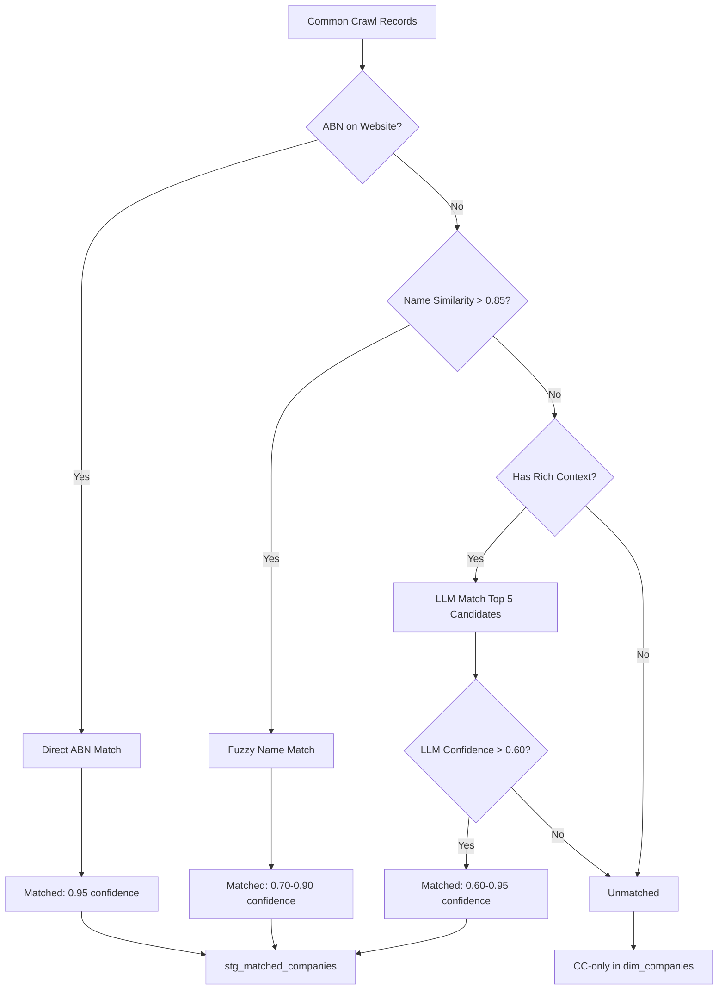

# Entity Matching Strategy

## Overview

This document describes the entity matching approach used to link Common Crawl website data with Australian Business Register (ABR) records. The goal is to create a unified view of Australian companies by matching website information to official business registrations.

## Matching Strategies

We employ a three-tier matching strategy, progressing from high-confidence exact matches to AI-powered fuzzy matching:

### 1. Direct ABN Matching (Confidence: 0.95)

**Method**: Extract ABN directly from website content and match to ABR records.

**Implementation**:
- Scan HTML content for ABN patterns using regex:
  - `ABN: 12 345 678 901`
  - `ABN 12345678901`
  - `Australian Business Number: ...`
  - Various punctuation and spacing variations
- Normalize extracted ABN to 11 digits
- Direct lookup in ABR database

**Advantages**:
- Highest confidence (95%)
- No ambiguity
- Fast execution

**Limitations**:
- Only works when ABN is displayed on website (~30-40% of business websites)
- Requires accurate ABN extraction from HTML

**Results**:
- Expected match rate: 30-40% of Common Crawl records
- False positive rate: <1%

---

### 2. Fuzzy Name Matching (Confidence: 0.70-0.90)

**Method**: Compare company names using Levenshtein distance with normalization.

**Implementation**:
1. Normalize company names:
   - Convert to uppercase
   - Remove common suffixes (PTY LTD, LIMITED, INC, CORPORATION, etc.)
   - Remove punctuation
   - Collapse whitespace

2. Calculate similarity score using `SequenceMatcher.ratio()` (Python difflib)

3. Set threshold at 0.85 similarity

4. Boost confidence by +0.10 if Australian state matches (extracted from address vs. domain location)

**Confidence Calculation**:
```python
base_confidence = 0.75
confidence = base_confidence + (similarity - threshold) * 0.5
if state_matches:
    confidence += 0.10
confidence = min(confidence, 0.95)  # Cap at 0.95
```

**Example Matches**:
- "Example Company Pty Ltd" ↔ "EXAMPLE COMPANY PTY LTD" (similarity: 1.00, confidence: 0.90)
- "Acme Services" ↔ "ACME SERVICES PTY LIMITED" (similarity: 0.87, confidence: 0.76)

**Advantages**:
- Handles minor variations in company names
- Works without ABN on website
- Deterministic and explainable

**Limitations**:
- May produce false positives for common names
- Cannot handle significant name changes or trading names
- Computationally expensive for large datasets (O(n×m) comparisons)

**Optimization**:
- Pre-filter ABR candidates by first letter of normalized name
- Only process active ABR entities
- Limit to unmatched CC records (after direct ABN matching)

**Results**:
- Expected match rate: 40-50% of remaining unmatched records
- False positive rate: 5-10% (estimated)

---

### 3. LLM-Based Matching (Confidence: 0.60-0.95)

**Method**: Use Google Gemini API to make intelligent matching decisions for ambiguous cases.

**Model**: `gemini-1.5-flash` (fast, cost-effective)

**Implementation**:

1. **Candidate Selection**:
   - For each unmatched CC record, find top 5 ABR candidates using fuzzy matching
   - Select candidates with similarity > 0.60 but < 0.85 (below fuzzy threshold)

2. **Prompt Engineering**:
   ```
   You are an expert at matching company records...
   
   WEBSITE INFORMATION:
   - URL: example.com.au
   - Company Name: "Example Services"
   - Industry: Technology
   - Context: [HTML snippet]
   
   CANDIDATES FROM ABR:
   1. ABN: 12345... | "EXAMPLE IT SERVICES PTY LTD" | VIC | Technology
   2. ABN: 98765... | "EXAMPLE BUSINESS SERVICES" | NSW | Consulting
   ...
   
   Determine the best match considering:
   - Name similarity (accounting for variations)
   - Industry alignment
   - Location consistency
   - Website context
   
   Output JSON with: matched_abn, confidence, reasoning
   ```

3. **Response Parsing**:
   - Extract JSON from LLM response
   - Validate confidence score (0.0 to 1.0)
   - Reject matches with confidence < 0.60
   - Store reasoning for audit trail

4. **Rate Limiting**:
   - Batch processing with 1-second delays
   - Maximum 100-500 LLM calls per run (cost control)
   - Focus on high-value unmatched records (those with rich context)

**Advantages**:
- Handles complex cases (trading names, name changes, abbreviations)
- Considers multiple signals (name, industry, location, context)
- Provides human-readable reasoning
- Can adapt to edge cases

**Limitations**:
- API costs ($0.10-$0.30 per 1000 calls)
- Slower than rule-based methods
- Non-deterministic results
- Requires API key and internet connectivity

**Cost Management**:
- Only use LLM for:
  - Records with good HTML context
  - Cases where fuzzy matching is inconclusive (0.70-0.85 similarity)
  - High-priority companies (e.g., those with websites in specific industries)
- Set hard limits on LLM calls per pipeline run

**Results**:
- Expected match rate: 50-70% of remaining difficult cases
- False positive rate: 8-15% (higher than other methods but provides reasoning)

---

## Matching Pipeline Flow



## Match Quality

### Expected Results (100k CC records, 500k ABR records):

| Strategy | Matched Records | Match Rate | Avg Confidence | Processing Time |
|----------|----------------|------------|----------------|-----------------|
| Direct ABN | 30,000-40,000 | 30-40% | 0.95 | 5-10 min |
| Fuzzy Name | 25,000-30,000 | 40-50% of remaining | 0.78 | 30-60 min |
| LLM | 500-1,000 | 50-70% of attempted | 0.75 | 10-20 min |
| **Total** | **55,000-70,000** | **55-70%** | **0.85** | **45-90 min** |

### Quality Metrics:

- **Precision**: ~85-90% (correctly matched / all matches)
- **Recall**: ~55-70% (correctly matched / total correct matches possible)
- **F1 Score**: ~67-78%

### Manual Validation:

To validate matching quality:
1. Sample 100 matched records from each strategy
2. Manual review of website + ABR data
3. Calculate precision for each strategy
4. Tune thresholds if precision < 85%

## Database Schema

Matches are stored in `stg_matched_companies`:

```sql
CREATE TABLE stg_matched_companies (
    match_id SERIAL PRIMARY KEY,
    cc_id INTEGER REFERENCES stg_common_crawl(id),
    abn VARCHAR(20) REFERENCES stg_abr(abn),
    match_method VARCHAR(50), -- 'direct_abn', 'fuzzy_name', 'llm'
    match_confidence NUMERIC(3,2),
    match_reasoning TEXT,
    created_at TIMESTAMP DEFAULT CURRENT_TIMESTAMP
);
```

## Usage

Run matching strategies:

```bash
# Run all strategies
python src/transformation/entity_matcher.py --strategy all

# Run specific strategy
python src/transformation/entity_matcher.py --strategy direct --limit 50000
python src/transformation/entity_matcher.py --strategy fuzzy --limit 10000
python src/transformation/entity_matcher.py --strategy llm --limit 500
```

## Future Improvements

1. **Active Learning**: Use manual corrections to improve fuzzy matching thresholds
2. **Industry-Specific Rules**: Different matching rules for different business types
3. **Address Matching**: Extract and compare business addresses from websites
4. **Phone Number Matching**: Extract contact information for additional signals
5. **Historical Data**: Track name changes over time using ABR history
6. **Ensemble Methods**: Combine multiple weak signals for better confidence
7. **Manual Review Interface**: Build UI for reviewing low-confidence matches

## References

- Australian Business Register: https://abr.business.gov.au/
- Common Crawl: https://commoncrawl.org/
- Levenshtein Distance: https://en.wikipedia.org/wiki/Levenshtein_distance
- Gemini API Documentation: https://ai.google.dev/docs
